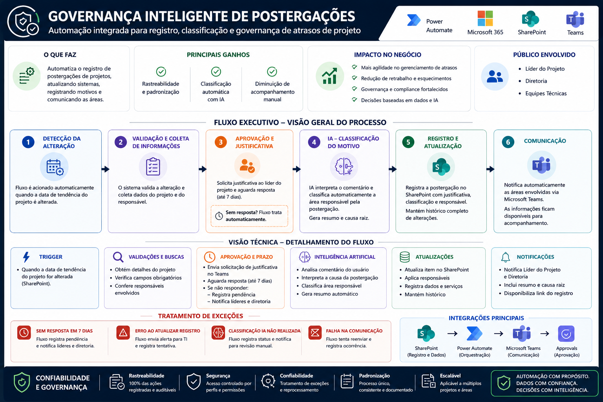
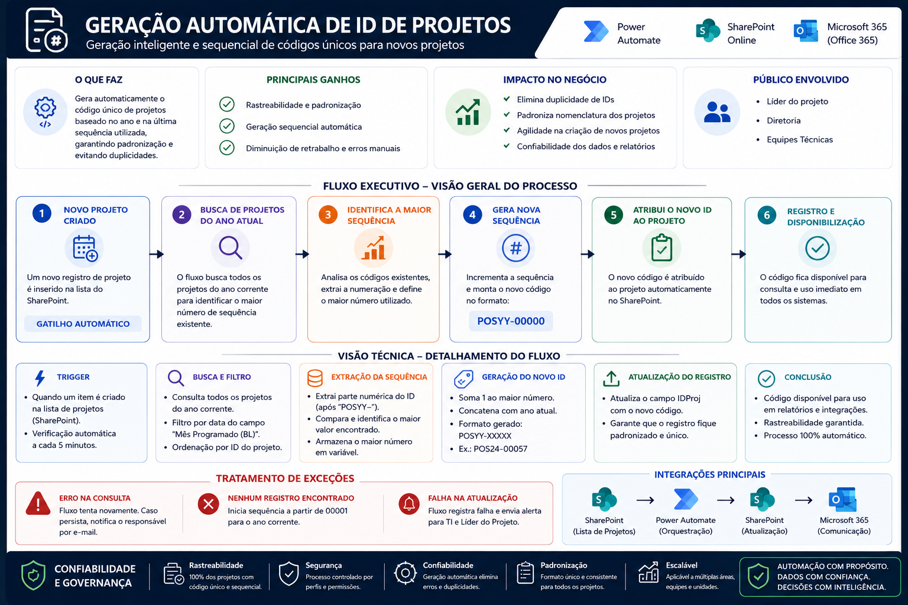
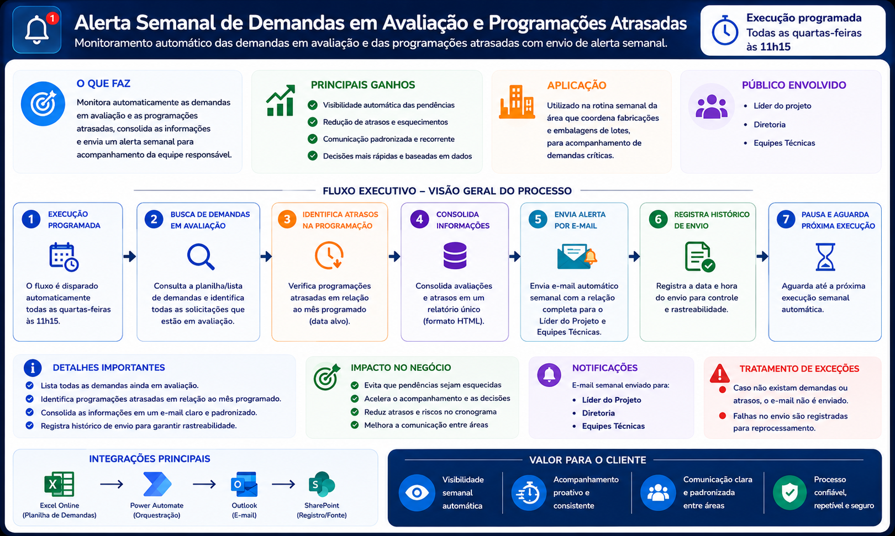

# Meus Projetos de Destaque - Power Automate

### Automação

* [Registro de Postergações](#projeto-1-registro-de-postergacoes-de-projetos)
* [Criação Automática de Código de Projetos](#projeto-2-criacao-automatica-de-codigo-de-projetos)
* [Alerta Semanal de Demandas](#projeto-3-alerta-semanal-de-demandas-em-avaliacao-e-programacoes-atrasadas)

### Projeto 1: Registro de Postergações de Projetos

 

* **O Problema:** Devido ao alto volume, os projetos eram postergados sem uma governança de registro de motivos. A ausência desse histórico dificultava a identificação das causas das alterações de prazo e a construção de planos de ação.
* **A Solução:** Assim que uma postergação é identificada, o fluxo dispara um formulário rápido e personalizado para preenchimento do gestor do projeto, exigindo inserção de justificativa da mudança. As informações são registradas em uma base que alimenta relatórios de acompanhamento.
* **Resultado obtido:** Redução aproximada de 24 horas mensais de atividades manuais para uma equipe de 8 colaboradores, além do aumento da rastreabilidade e padronização dos registros.
* **Stack/ferramentas utilizadas:** Power Automate, Microsoft Lists, Microsoft Teams, Power BI.

### Projeto 2: Criação Automática de Código de Projetos

* **O Problema:** Projetos distintos podem ser realizados para um mesmo produto e, devido à alta complexidade dos projetos farmacêuticos, muitos controles são utilizados. Sem uma codificação eficiente, há perda de rastreabilidade e dificuldade de integração entre bases de dados.
* **A Solução:** Assim que um projeto é criado no Microsoft Lists, o fluxo gera automaticamente um código único baseado no ano e na última sequência utilizada anteriormente. Após a criação, as áreas técnicas são notificadas automaticamente.
* **Resultado obtido:** Aproximadamente 60 projetos codificados por mês.
* **Stack/ferramentas utilizadas:** Power Automate, Microsoft Lists.

### Projeto 3: Alerta Semanal de Demandas em Avaliação e Programações Atrasadas

* **O Problema:** Demandas em avaliação e programações atrasadas precisavam ser identificadas manualmente em diferentes controles operacionais, aumentando o risco de atrasos passarem despercebidos.
* **A Solução:** Desenvolvi um fluxo automatizado que executa semanalmente, consulta as bases de acompanhamento, identifica pendências e atrasos, consolida as informações em um relatório único e envia notificações automáticas aos responsáveis.
* **Resultado obtido:** Aproximadamente 40 projetos ativos monitorados por semana, redução do acompanhamento manual de pendências e aumento da visibilidade para liderança e equipes técnicas.
* **Stack/ferramentas utilizadas:** Power Automate, Excel Online, SharePoint, Outlook, HTML para geração dinâmica de relatórios.
