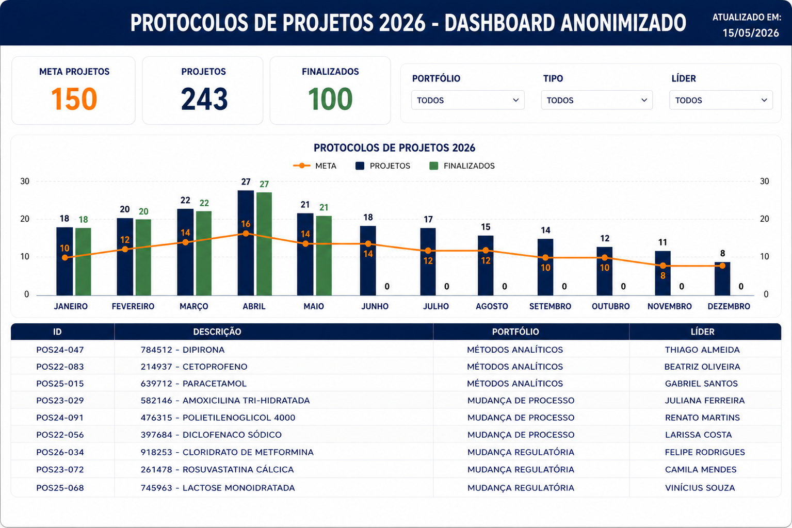
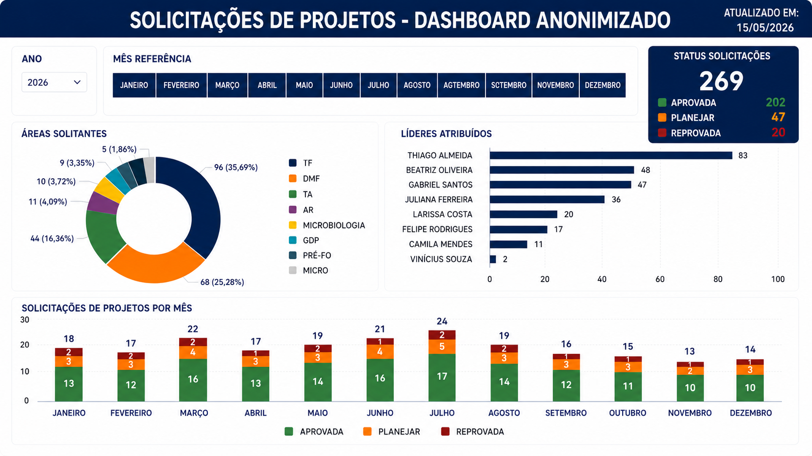
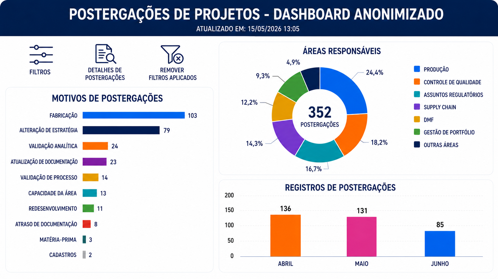
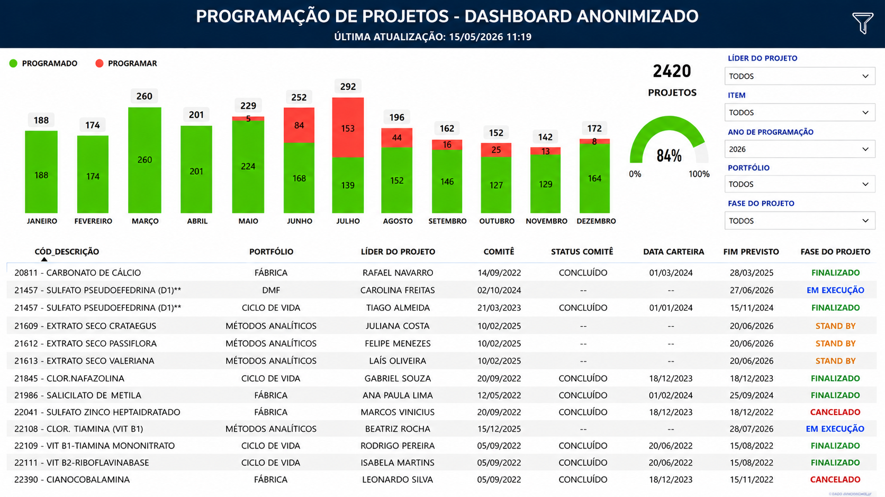
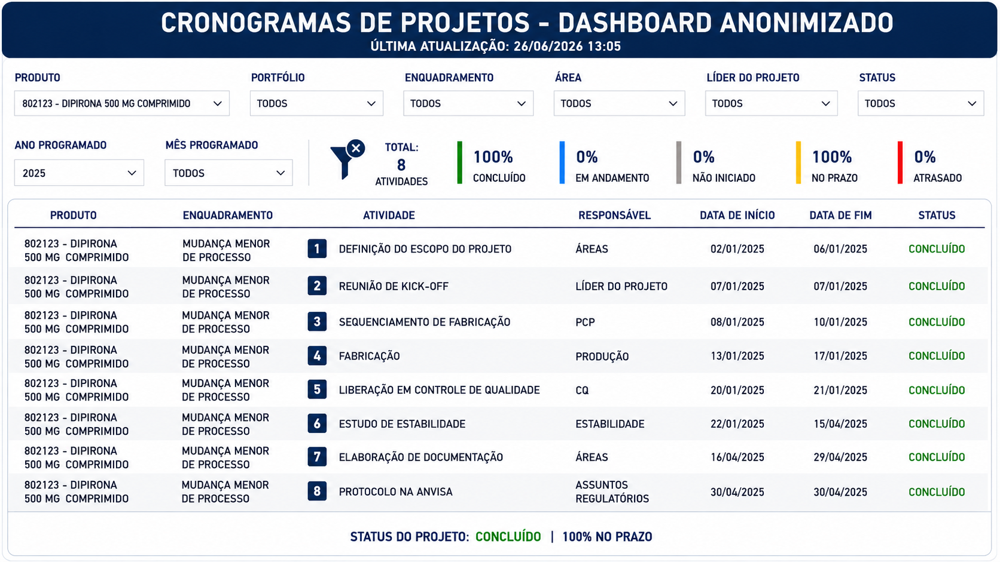
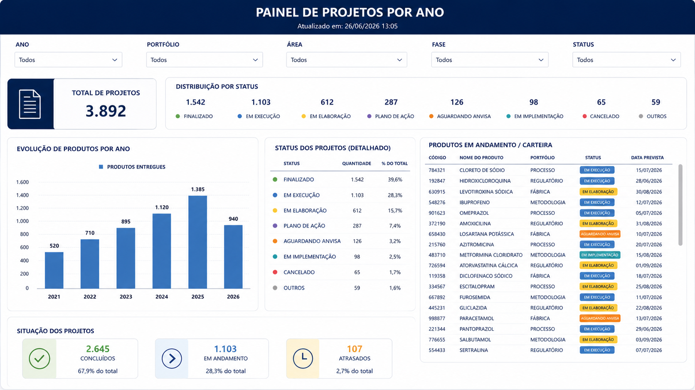

# Business Intelligence

## [🏠 Página Inicial](index.md)

## Business Intelligence

* [Dashboard Executivo de Projetos Prioritários](#painel1)
* [Painéis de Solicitações e Postergações](#painel2)
* [Dashboard de Capacidade e Produtividade da Equipe](#painel3)
* [Dashboard de Cronogramas e Regularizações](#painel4)
* [Dashboard de Gestão de Portfólio e Entregas Anuais](#painel5)

## Painel 1: Dashboard Executivo de Projetos Prioritários

* **O Problema:** Necessidade de consolidar informações de projetos prioritários em uma única fonte confiável para acompanhamento gerencial e suporte à tomada de decisão.
* **A Solução:** Utilização de dashboard executivo para acompanhamento de indicadores estratégicos, mudanças, postergações e status dos projetos prioritários. O painel consolida informações provenientes de múltiplas fontes de dados e fornece visibilidade para lideranças e stakeholders, apoiando o acompanhamento e a tomada de decisão.
* **Ferramentas/Stack:**  Excel, Power BI, Power Query, SharePoint Lists, Modelagem Dimensional (Star Schema).

---

## Painéis 2: Painéis de Solicitações e Posteriores Postergações de Projetos

 
 

* **O Problema:** Ausência de rastreabilidade, padronização e visibilidade sobre o ciclo de vida dos projetos, dificultando o acompanhamento de solicitações, postergações, responsáveis e status das entregas.
* **A Solução:** Estruturação de um fluxo integrado entre Microsoft Forms, Microsoft Lists, Power Automate e Power BI para registro e acompanhamento de solicitações e postergações de projetos. As informações são consolidadas em painéis de acompanhamento operacional e gerencial, permitindo maior rastreabilidade e visibilidade do ciclo de vida dos projetos.
* **Ferramentas/Stack:** Power Automate, Microsoft Lists, Microsoft Forms, Power BI, Power Query, Modelagem Dimensional (Star Schema).

---

## Painel 3: Dashboard de Gerenciamento de Capacidade e Produtividade de Equipe de Projetos

 

* **O Problema:** Falta de visibilidade consolidada sobre o andamento das programações de projetos solicitados, dificultando a distribuição proporcional de projetos entre a equipe, considerando seu escopo e dificuldade, bem como impossibilitando um report para à gestão.
* **A Solução:** Utilização de dashboard para acompanhamento da capacidade operacional da equipe, distribuição das demandas, status dos projetos e cumprimento dos prazos planejados. O painel permite acompanhar a evolução das atividades e fornecer informações consolidadas para gestão e planejamento das entregas.
* **Stack:** Excel, Power BI, Power Query, SharePoint, Modelagem Dimensional (Star Schema).

--- 

## Painel 4: Dashboard de Cronogramas e Regularizações

 

* **O Problema:** Necessidade de acompanhamento centralizado dos cronogramas, prazos e entregas de projetos, diminuindo o risco de desvios e atrasos por parte das áreas técnicas impactadas.
* **A Solução:** Estruturação e manutenção de base de dados para acompanhamento das atividades dos projetos, associada a dashboard para monitoramento de cronogramas, etapas e responsáveis. A solução permite acompanhar desvios, identificar riscos relacionados a prazos e apoiar o controle das entregas.
* **Ferramentas/Stack:** Excel, Power BI, Power Query, Modelagem Dimensional (Star Schema).

---

## Painel 5: Dashboard de Gestão de Portfólio e Acompanhamento Anual de Entregas
 

* **O Problema:** Falta de visibilidade consolidada sobre o andamento das entregas anuais, produtividade e capacidade das equipes e evolução dos projetos ao longo do tempo.
* **A Solução:** Consolidação das informações de portfólio em dashboard de acompanhamento gerencial, permitindo visualizar a evolução das entregas ao longo do ano, a produtividade das equipes e o andamento dos projetos. O painel fornece uma visão executiva para suporte às discussões de planejamento e acompanhamento dos resultados.
* **Stack:** Excel, Power BI, Power Query, SharePoint, Modelagem Dimensional (Star Schema).
